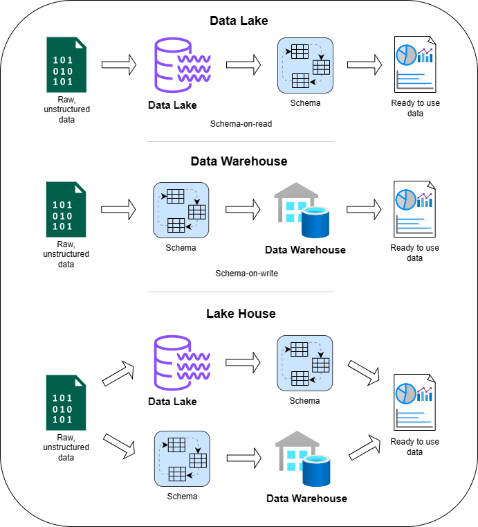

# Project hello-DBMS #

To launch the Flask app, install Flask and sqlite3, then run app.py and go to http://127.0.0.1:5000/
  
  
## A. What is Data?

Data refers to distinct pieces of information, usually formatted and stored in a way that is concordant with a specific purpose. It can represent qualitative or quantitative attributes and can come in various forms. The primary aim of data is to provide insight or information.

### Forms of Data:

1. **Structured Data**: This is highly organized and easily understood by machine language, typically stored in well-defined schemas like databases. For example, names, dates, addresses, credit card numbers, stock information, geolocation, etc.

2. **Unstructured Data**: This is information that doesn't have a pre-defined model or isn't organized in a pre-defined manner. It's often text-heavy and may contain dates, numbers, and facts. For example, books, journals, emails, social media posts, videos, images, and audio files.

3. **Semi-structured Data**: This type of data doesn't reside in a relational database but does have some organizational properties that make it easier to analyze. It might have metadata or tags. Examples include XML files, JSON documents, and certain types of data from NoSQL databases.

4. **Quantitative Data**: This is numerical data, anything that can be measured and written down with numbers. For instance, this can include statistical data, measurements, counts, or percentages.

5. **Qualitative Data**: This is descriptive data and concerns properties and attributes that can't be measured directly with numbers but can be observed qualitatively. Examples include survey responses, interview transcripts, and descriptive phrases.

Data is crucial for analysis, making informed decisions, and formulating strategies in various domains, including science, business, healthcare, and more.

  
## B. Criteria for Measuring Data Quality

Data quality is vital for ensuring reliable analytics and decision-making. Six common dimensions are used to measure the quality of data:

1. **Accuracy**: Reflects how closely data represents the true values. Accurate data correctly depicts the real-world scenario it represents.

2. **Completeness**: Ensures that no critical data is missing and all necessary information is present in the dataset.

3. **Consistency**: Data remains the same across different datasets and systems. Consistent data does not contradict itself and provides uniform results.

4. **Timeliness**: Evaluates whether data is up-to-date and available when required. It should reflect the most current situation for its intended use.

5. **Reliability**: Data is considered reliable if it can be depended upon for its accuracy and consistency over time. It comes from a reputable source and provides the same results under consistent conditions.

6. **Uniqueness**: Each data element is unique and not duplicated within the dataset. This ensures the dataset is clean, and each entry is distinct.

### Importance of Data Quality:

Maintaining high-quality data is essential for accurate decision-making and operational efficiency. Low-quality data can lead to incorrect conclusions, wasted resources, and decreased trust in data systems.

### References:
- "What is Data Quality and Why is it Important?" - [Talend](https://www.talend.com/resources/what-is-data-quality/)
  
  
## C. Data Lake vs. Data Warehouse vs. Lake House

| Criteria        | Data Lake                                      | Data Warehouse                                  | Lake House                                      |
|-----------------|------------------------------------------------|-------------------------------------------------|-------------------------------------------------|
| **Definition**  | A centralized repository for all types of data, both structured and unstructured, at any scale. | A system optimized for analyzing and reporting structured, processed data. | A hybrid model combining the flexibility of a Data Lake with the management of a Data Warehouse. |
| **Characteristics** | - Stores raw, unstructured data.<br>- Schema-on-read.<br>- Ideal for big data and real-time analytics. | - Stores processed, structured data.<br>- Schema-on-write.<br>- Ideal for historical data analysis and business intelligence. | - Combines features of Data Lakes and Warehouses.<br>- Supports raw and processed data.<br>- Offers data management and ACID transactions. |
| **Flexibility** | Most flexible, accepts all types of data. | Less flexible, requires pre-defined schemas. | Provides a middle ground with flexible storage and management. |
| **Data Quality** | May contain raw, unverified data. | Often has higher data quality due to processing and structuring. | Maintains a balance with data management features. |
| **Use Case**    | Ideal for big data processing and data science. | Best for structured reporting and business intelligence. | Versatile, catering to both analytics and operational purposes. |

Data processing differences in Data Lake, Data Warehouse and Lake House:



### References:
- "Data Lake vs. Data Warehouse" - [AWS](https://aws.amazon.com/big-data/datalakes-and-analytics/what-is-a-data-lake/)
- "What is a Data Lakehouse?" - [Databricks](https://databricks.com/glossary/data-lakehouse)
- - "Schema on read and Schema-on-write" - [Medium](https://medium.com/@deepa.account/schema-on-read-and-schema-on-write-ac72524926b)
  
  
## D. Database Management Systems (DBMS)

### Definition:
A Database Management System (DBMS) is software designed to store, manipulate, and retrieve data efficiently and securely. It provides the necessary tools to create, manage, and interact with one or more databases.

### Comparison of DBMS:

| DBMS         | Description                                                                                                            | Illustration                          | Source                                    |
|--------------|------------------------------------------------------------------------------------------------------------------------|---------------------------------------|-------------------------------------------|
| **MySQL**    | MySQL is an open-source relational database management system, very popular for web applications.                        |  | [Official MySQL Site](https://www.mysql.com/) |
| **PostgreSQL**| PostgreSQL is an advanced, open-source relational DBMS, focusing on standards and extensibility.                        |  | [Official PostgreSQL Site](https://www.postgresql.org/) |
| **MongoDB**  | MongoDB is a NoSQL document-oriented DBMS offering high flexibility and performance for applications with large data volumes. |  | [Official MongoDB Site](https://www.mongodb.com/) |
| **Oracle Database** | Oracle Database is a powerful and comprehensive relational DBMS used for large enterprise applications.               |  | [Official Oracle Site](https://www.oracle.com/database/) |
| **SQLite** | SQLite is a lightweight, self-contained, open-source relational database engine widely used for embedded and mobile applications. |  | [Official SQLite Site](https://www.sqlite.org/index.html)

  
## E. Relational vs. Non-Relational Databases

### Definitions, Examples, and Applications:

| Type                     | Definition                                                                                          | Example        | Applications                                                       |
|--------------------------|-----------------------------------------------------------------------------------------------------|----------------|--------------------------------------------------------------------|
| **Relational Database**  | Stores data in tables with fixed rows and columns. Based on the relational model and uses SQL.       | MySQL, PostgreSQL | Banking systems, airline reservation systems, HR management.       |
| **Non-Relational Database** | Stores data in document, key-value, graph, or wide-column stores. Known as NoSQL databases. | MongoDB, Cassandra  | Social media platforms, real-time analytics, IoT applications.    |

### Comparison:

| Criteria                      | Relational Database                                                      | Non-Relational Database                              |
|-------------------------------|--------------------------------------------------------------------------|------------------------------------------------------|
| **Data Structure**            | Tables with fixed rows and columns                                       | Document, key-value, graph, or wide-column stores    |
| **Schema**                    | Fixed schema                                                             | Dynamic schema                                       |
| **Scalability**               | Vertical (scale-up by adding more power to existing hardware)             | Horizontal (scale-out across commodity servers)       |
| **Query Language**            | SQL                                                                      | Varies (e.g., NoSQL query language)                  |
| **Transactions**              | ACID transactions (Atomicity, Consistency, Isolation, Durability)         | BASE (Basically Available, Soft state, Eventual consistency) |
| **Use Case Examples**         | Financial records, HR management systems                                 | Real-time analytics, IoT applications                |

**References:**
- "Relational vs. Non-Relational Databases" - [IBM Cloud Education](https://www.ibm.com/cloud/learn/relational-databases)
- "When to use NoSQL Database" - [AWS](https://aws.amazon.com/nosql/)
  
  
## F. Primary Key vs. Foreign Key

| Type          | Definition                                                                                      | Purpose                                                                                                  |
|---------------|-------------------------------------------------------------------------------------------------|----------------------------------------------------------------------------------------------------------|
| **Primary Key** | A unique identifier for a record in a table. It must contain unique values and cannot be null.   | To uniquely identify each record in a table.                                                             |
| **Foreign Key** | A field in one table that uniquely identifies a row of another table or the same table.         | To create a link between two tables, representing relationships and enforcing referential integrity.     |

*Primary keys and foreign keys are fundamental concepts in relational databases, crucial for maintaining data integrity and establishing relationships between tables.*

**References:**
- "SQL Primary Key" - [W3Schools](https://www.w3schools.com/sql/sql_primarykey.asp)
- "SQL Foreign Key" - [W3Schools](https://www.w3schools.com/sql/sql_foreignkey.asp)

  
## G. ACID Properties

ACID is an acronym that stands for Atomicity, Consistency, Isolation, and Durability. These are the properties that guarantee database transactions are processed reliably and help maintain the integrity of the database even in the event of errors, power failures, or other mishaps.

| Property        | Definition                                                                                                     |
|-----------------|----------------------------------------------------------------------------------------------------------------|
| **Atomicity**   | Ensures that each transaction is treated as a single "unit," which either succeeds completely or fails completely. If any part of the transaction fails, the entire transaction fails, and the database state is left unchanged. |
| **Consistency** | Ensures that a transaction can only bring the database from one valid state to another, maintaining database invariants. After the transaction is completed, all data must be valid according to all defined rules. |
| **Isolation**   | Transactions are isolated from each other until they're completed. Changes from a transaction are not visible to other transactions until the transaction is committed. This prevents concurrent transactions from interfering with each other. |
| **Durability**  | Once a transaction has been committed, it will remain so, even in the event of power loss, crashes, or errors. In a relational database, for instance, once a group of SQL statements execute, the results need to be stored permanently (even if the database crashes immediately thereafter). |

**Examples and Applications:**
- **Atomicity**: In a banking system, when transferring money from one account to another, both the debit and credit operations must complete together. If one fails, the other must be rolled back.
- **Consistency**: When booking a flight, a seat can be sold only once. The system must ensure that once a seat is booked, it's marked as unavailable to other customers.
- **Isolation**: When multiple clerks are selling tickets, the system must ensure that they see a consistent view of available seats to prevent double-booking.
- **Durability**: After confirming a reservation, the booking details must not be lost, even if there's a system failure.


## H. Merise and UML Methods: Overview and Historical Use

### Relationship and Overview
Both Merise and Unified Modeling Language (UML) are methodologies - visual languages - used to visualize and plan out aspects of information systems. **Merise** is a structured methodology primarily used for designing and implementing databases. **UML** is a more flexible set of diagrams used to model software systems. Essentially, Merise helps in organizing the data structure, and UML assists in detailing behavior and architecture of a system.

### Merise Method
- **Origin:** Developed in France in the 1970s.
- **Usage:** Initially used extensively in French-speaking countries, it became a standard for database design, especially in Europe.
- **Merise in Action:** Used in the 1980s and 1990s by European government agencies and companies to systematically design their databases.

Example of database structure using Merise method:
 

### Unified Modeling Language (UML)
- **Origin:** Introduced in the 1990s by Grady Booch, Ivar Jacobson, and James Rumbaugh.
- **Usage:** Gained rapid worldwide adoption due to its versatility and became a standard language for software modeling.
- **UML in Action:** Adopted by tech giants like IBM and Microsoft in the late 1990s to design complex software systems, including operating systems and enterprise solutions.

An example of Class diagram in Unified Modeling Language: 


Different types of UML diagrams:


**References:**
- "The Unified Modeling Language" - [UML Official Website](https://www.uml.org)
- "Unified Modeling Language Introduction" - [GeeksForGeeks](https://www.geeksforgeeks.org/unified-modeling-language-uml-introduction/)

**Note:** Both methodologies have evolved with technology, but their core principles remain integral in system design and development.
    
 
## I. Definition of SQL and Common Commands

### SQL (Structured Query Language)
**Definition:** SQL is a standardized programming language specifically designed for managing and manipulating relational databases. It's used for tasks such as querying data, updating records, and managing database structures.

### Commonly Used SQL Commands

1. **SELECT**
```sql
   SELECT column1, column2 FROM table_name;
   -- Retrieves specific columns from a table
```

2. **ALTER**
```sql
    ALTER TABLE table_name ADD new_column datatype;
    -- Adds a new column to a table
```

3. **DROP** 
```sql
    DROP TABLE table_name;
    -- Deletes an entire table and its data
```

4. **CREATE**
```sql
    CREATE TABLE table_name (column1 datatype, column2 datatype);
    -- Creates a new table with specified columns
```

5. **WHERE**
```sql
    SELECT * FROM table_name WHERE condition;
    -- Retrieves rows that meet the specified condition
```

6. **LIKE**
```sql
    SELECT * FROM table_name WHERE column LIKE pattern;
    -- Finds rows where a column's value matches a specified pattern
```

7. **BETWEEN**
```sql
    SELECT * FROM table_name WHERE column BETWEEN value1 AND value2;
    -- Selects rows where a column's value is within a specified range
```

8. **IN**
```sql
    SELECT * FROM table_name WHERE column IN (value1, value2);
    -- Selects rows where a column's value matches any value in the list 
```

### Different Types of SQL Joins

1. **INNER JOIN**
```sql
    SELECT * FROM table1 INNER JOIN table2 ON table1.column_name = table2.column_name;
    -- Returns rows when there is a match in both tables
```

2. **LEFT (OUTER) JOIN**
```sql
    SELECT * FROM table1 LEFT JOIN table2 ON table1.column_name = table2.column_name;
    -- Returns all rows from the left table, and matched rows from the right table
```

3. **RIGHT (OUTER) JOIN**
```sql
    SELECT * FROM table1 RIGHT JOIN table2 ON table1.column_name = table2.column_name;
    -- Returns all rows from the right table, and matched rows from the left table
```

4. **FULL (OUTER) JOIN**
```sql
    SELECT * FROM table1 FULL OUTER JOIN table2 ON table1.column_name = table2.column_name;
    -- Returns all rows when there is a match in one of the tables
```

**References:**
- "SQL Fundamentals" - [W3Schools](https://www.w3schools.com/sql/)
- "Introduction to SQL" - [Khan Academy](https://www.khanacademy.org/computing/computer-programming/sql)
